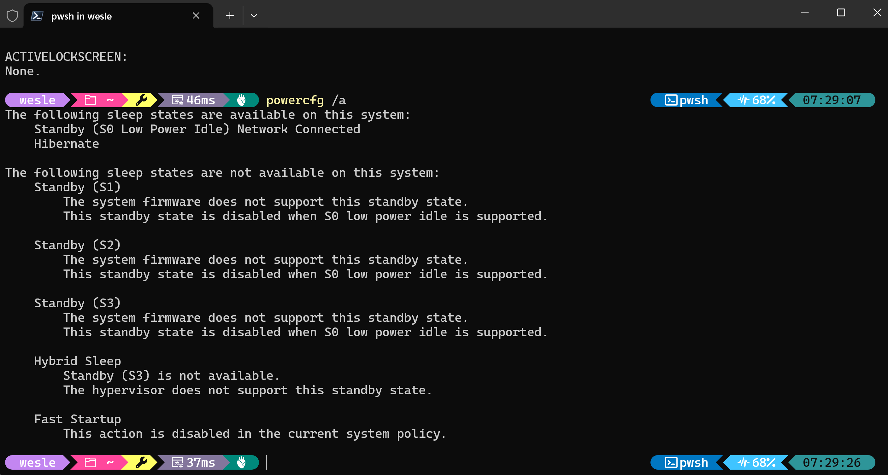

+++
date = '2026-02-14T07:56:09-06:00'
draft = false
title = 'Windows Modern Standby'
+++

# Why Microsoft, Why?

This week I got a refurbished Windows laptop (yay sustainability!) for personal use -- A [Dell Precision 5560](https://www.dell.com/en-us/shop/cty/pdp/spd/precision-15-5560-laptop). In almost all regards, this is a very nice laptop. Fast processor, great touchscreen display, 32 GB RAM, etc. But when I close the lid... nothing happens. Fans keep spinning, bottom of the case is hot, and now I don't trust that this thing knows how to go to sleep.

This is the first Windows laptop I've purchased for personal use in over a decade. I use windows laptops at work, so I've been aware of some of the flakiness with Windows Sleep over the past few years, but generally, I'll just shut down and start up fresh in the morning the next day. My previous personal Windows laptop, a 2015 Dell Latitude, never exhibited this issue with sleep. Why's that? It supported S3 sleep mode or what used to be "regular" sleep.

This new(er) Precision does not support S3 sleep at all. I was hoping there was a toggle in BIOS / UEFI setup, but nope. Just S0, or more specifically, `Standby (S0 Low Power Idle) Network Connected`. Essentially what this means is the computer never really goes to sleep. This is not a crazy concept; our smartphones do this all the time. I think everyone would go nuts if we had to put our phones to "sleep". The problem for this laptop is that it's running a power hungry Intel i7 processor. The hardware / firmware of this notebook essentially cannot sleep. It's up to Windows to stop the running processes and allow it to slumber. This step does not happen. Background tasks are still running, CPU is still performing calculations, and ultimately, this will kill the battery quickly.

## The "Solution"?

To "fix" this, I opted to just have the lid close action trigger hibernation. This feels like a blast to the past, but here we are in the year 2026 with laptops which can't sleep better than those in from 20 years ago. 

## The Linux Experiment

Frustrated with Windows, I wanted to see if running Linux would help out any. I side-loaded [CachyOS](https://cachyos.org/) on another partition, and tried out this distro for the first time. Overall, I am impressed with CachyOS. It's support for this hardware was decent, although I didn't find the audio quality out of the built-in speakers to be great. Those realtek drivers must be doing some real magic in Windows.

Back to sleep -- unfortunately, sleep is no better on the linux side. The hardware doesn't support S3, so linux cannot sleep either. I was hoping some of the background scheduling would be a bit better, but still found the battery would be completely drained if I left it to sleep for more than 4-5 hours. Not great. Hibernation in CachyOS was also not a simple toggle. Back to Windows for my day-to-day...

# Note to the Hardware Manufacturers

Just because Microsoft would like everyone to go down this "[Modern Standby](https://learn.microsoft.com/en-us/windows-hardware/design/device-experiences/modern-standby)" route, doesn't mean that the hardware has to stop supporting S3 altogether. By removing this feature, you make an otherwise good laptop difficult to use, especially for non-technical users. My M1 Macbook Pro will go to sleep without question when I close the lid. I don't even have to think about it. I know the battery will be within 1% of what it was when I closed it. That is the experience the vast majority of people expect
